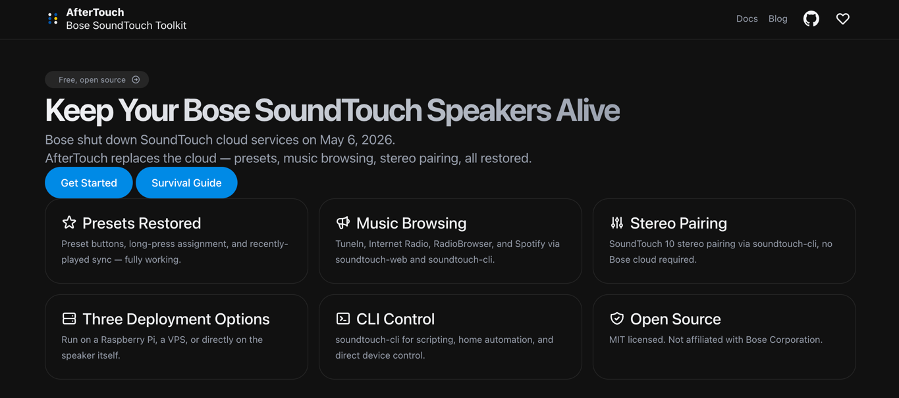

#  AfterTouch
<p style="margin-top: -10px; font-style: italic; color: #666;">Bose SoundTouch Toolkit</p>

[](https://pkg.go.dev/github.com/gesellix/bose-soundtouch)
[](https://goreportcard.com/report/github.com/gesellix/bose-soundtouch)
[](https://opensource.org/licenses/MIT)

> Independent project. **Not affiliated with, endorsed by, sponsored
> by, or otherwise connected to Bose Corporation.** See
> [Disclaimer](#disclaimer) for the full statement.

## The Bose Cloud Has Shut Down

Bose shut down SoundTouch cloud services on **May 6, 2026**. Presets, music service browsing, and stereo pairing no longer work through Bose's infrastructure. AfterTouch restores all of these — no Bose infrastructure required.

See the [Survival Guide](https://gesellix.github.io/Bose-SoundTouch/docs/guides/SURVIVAL-GUIDE/) for the full picture.

[](https://gesellix.github.io/Bose-SoundTouch/)

---

## Tools

### soundtouch-service — AfterTouch

A local server that replaces the Bose cloud ("AfterTouch"). Once your speaker is redirected to it, you have full control without any Bose cloud dependency. The built-in web UI at `http://localhost:8000` handles all setup — no config files needed to get started.

Not sure which approach fits your situation? See the [Deployment Overview](./docs/content/docs/guides/DEPLOYMENT-OVERVIEW.md) — it compares running AfterTouch on a Raspberry Pi or other always-on host against running it directly on the SoundTouch speaker, with links to step-by-step walkthroughs for each path.

**Getting started:**

**Already migrated before May 6** — your presets and credentials are preserved. AfterTouch picks up where the Bose cloud left off.

**Starting fresh (or after a factory reset)** — create a local account, configure your speakers, and start using them immediately.

**Redirecting your speaker**

The service needs a stable address on your local network (e.g. `soundtouch.fritz.box` or `soundtouch.local`). The speaker must then be redirected to resolve the Bose cloud hostnames to that address. Two supported methods:

| Method       | How it works                        | Notes                                                        |
|--------------|-------------------------------------|--------------------------------------------------------------|
| XML redirect | Upload a config XML via the Web API | Surgical; covers only registered endpoints; best for testing |
| DNS/DHCP     | Serve custom DNS on your network    | Covers all devices at once; requires port 53 and TLS         |

The web UI walks you through each method. DNS redirect requires HTTPS — the service manages its own CA certificate and the web UI guides you through trusting it on each speaker.

> **Note:** A hosts-file method (direct SSH edits to `/etc/hosts`) also exists in the codebase but is deprecated and not exposed in the web UI.

**Enabling SSH via USB stick**

Some setup steps require SSH access to the speaker. Enable it once per device: create a file named `remote_services` on a FAT-formatted USB drive (the drive may need its bootable flag set — see [SoundCork issue #172](https://github.com/deborahgu/soundcork/issues/172)), and insert it while the speaker is powered on. After reboot, root SSH is available with no password.

See [Device Initial Setup](https://gesellix.github.io/Bose-SoundTouch/docs/guides/DEVICE-INITIAL-SETUP/) and [Migration Guide](https://gesellix.github.io/Bose-SoundTouch/docs/guides/MIGRATION-GUIDE/) for step-by-step instructions.

---

### soundtouch-backup

Backs up your Bose cloud account (presets, paired devices, music sources) and each speaker's local state before the shutdown. Run `soundtouch-backup all` to capture everything in one step; it authenticates with the Bose cloud, then polls each paired speaker over the local network.

See the [soundtouch-backup README](cmd/soundtouch-backup/README.md) for usage.

---

### soundtouch-cli

Command-line control of any SoundTouch device: play/pause/volume, presets, source selection, multiroom zones, device discovery, and more. Works entirely over the local network — no cloud dependency. Well-suited for scripting and home automation.

See the [CLI Reference](https://gesellix.github.io/Bose-SoundTouch/docs/guides/CLI-REFERENCE/) for full usage.

---

### soundtouch-web

A standalone web UI for device control — play, pause, volume, preset selection, real-time status — served from a local Go binary. Complements `soundtouch-service` when you want a dedicated device-control interface separate from the setup/admin UI.

See the [soundtouch-web README](cmd/soundtouch-web/README.md) for usage.

---

### Go library

`pkg/client` provides a Go API for all SoundTouch device endpoints: media control, volume, presets, sources, zones, real-time WebSocket events, and device discovery. Use it to build your own integrations.

```
go get github.com/gesellix/bose-soundtouch
```

See the [API Reference](https://gesellix.github.io/Bose-SoundTouch/docs/reference/API-ENDPOINTS/) and [pkg.go.dev](https://pkg.go.dev/github.com/gesellix/bose-soundtouch) for documentation.

---

## Documentation

- [Getting Started](https://gesellix.github.io/Bose-SoundTouch/docs/guides/GETTING-STARTED/)
- [Survival Guide](https://gesellix.github.io/Bose-SoundTouch/docs/guides/SURVIVAL-GUIDE/)
- [Migration Guide](https://gesellix.github.io/Bose-SoundTouch/docs/guides/MIGRATION-GUIDE/)
- [Device Initial Setup](https://gesellix.github.io/Bose-SoundTouch/docs/guides/DEVICE-INITIAL-SETUP/)
- [Migration & Safety Guide](https://gesellix.github.io/Bose-SoundTouch/docs/guides/MIGRATION-SAFETY/)
- [CLI Reference](https://gesellix.github.io/Bose-SoundTouch/docs/guides/CLI-REFERENCE/)
- [SoundTouch Service Guide](https://gesellix.github.io/Bose-SoundTouch/docs/guides/SOUNDTOUCH-SERVICE/)
- [HTTPS & CA Setup](https://gesellix.github.io/Bose-SoundTouch/docs/guides/HTTPS-SETUP/)
- [API Reference](https://gesellix.github.io/Bose-SoundTouch/docs/reference/API-ENDPOINTS/)

---

## Related projects

- **[SoundCork](https://github.com/deborahgu/soundcork)** (Deborah Kaplan et al.) — Python service interception; pioneered the cloud emulation approach this project builds on
- **[SoundCork Stockholm App](https://github.com/krahl/soundcork-stockholm-app)** — Companion app for SoundCork
- **[SoundTouch Plus](https://github.com/thlucas1/homeassistantcomponent_soundtouchplus)** (Todd Lucas) — Home Assistant integration; extensive undocumented API documentation
- **[ÜberBöse API](https://github.com/julius-d/ueberboese-api)** (Julius) — API research and advanced endpoint discovery
- **[Bose SoundTouch Hook](https://github.com/CodeFinder2/bose-soundtouch-hook)** (Adrian Böckenkamp) — `LD_PRELOAD` hooking for reverse engineering device internals

---

## Support

- Bug reports: [GitHub Issues](https://github.com/gesellix/bose-soundtouch/issues/new)
- Questions & discussions: [GitHub Discussions](https://github.com/gesellix/bose-soundtouch/discussions)

---

**Star this project** ⭐ if you find it useful!

---

## Contributing

Issues and pull requests welcome — code, documentation, bug reports, and feature ideas all land in the same place. By submitting a contribution you agree to license it under MIT. For significant changes please open an issue first to discuss the approach. See [CONTRIBUTING.md](CONTRIBUTING.md) for the full guide.

## Support the project

If this toolkit kept a speaker (or several) of yours alive past the Bose cloud shutdown and you want to give back, [GitHub Sponsors](https://github.com/sponsors/gesellix) is open. No expectation — everything in this repo stays MIT regardless.

[](https://github.com/sponsors/gesellix)

## Disclaimer

This is an independent open-source project. **Bose** and **SoundTouch**
are registered trademarks of Bose Corporation in the United States and
other countries. This project is **not affiliated with, endorsed by,
sponsored by, or otherwise connected to** Bose Corporation.

The toolkit exists solely to restore functionality of Bose SoundTouch
speakers after the official cloud service shutdown on May 6, 2026.
Reverse engineering for the sole purpose of interoperability is
permitted under [EU Directive 2009/24/EC, Article 6](https://eur-lex.europa.eu/legal-content/EN/TXT/?uri=CELEX:32009L0024)
("Decompilation"), and comparable provisions in other jurisdictions.

The optional Stockholm frontend integration (`STOCKHOLM_DIR`) requires
the user to supply the Stockholm web-app sources themselves; no Bose
code is redistributed in this repository.

The software is provided AS IS, without warranty. Use at your own risk.

## License

MIT — see [LICENSE](LICENSE).
