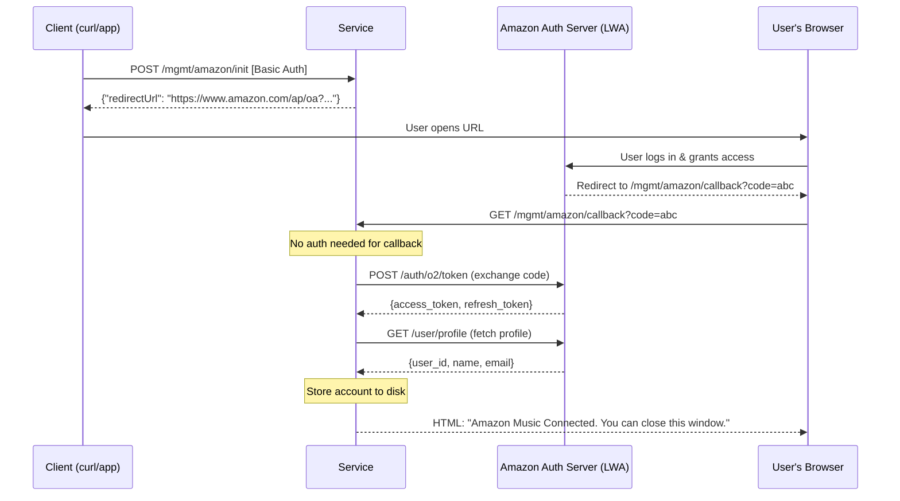
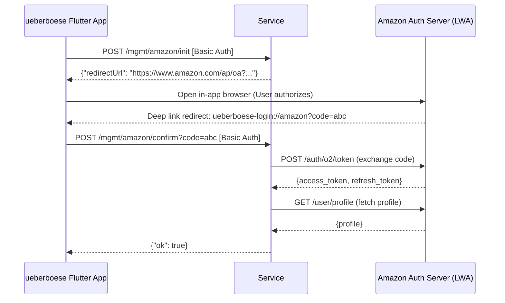

# Amazon Music OAuth Integration

This document describes the plan and specification for adding Amazon Music OAuth support to the SoundTouch service, enabling continued Amazon Music playback after the Bose cloud shutdown (May 2026).

The implementation mirrors the [Spotify OAuth integration](spotify-oauth.md) closely. Read that document first — this one calls out only the differences.

## Status

**Infrastructure complete — streaming blocked by API access.**

All eight implementation steps are done. The OAuth flow (account linking, token storage, token refresh) works end-to-end with a standard Login with Amazon app. Token exchange (`/oauth/device/.../token/cs1`) succeeds and the speaker receives a valid `Atza|` access token.

However, real-world testing shows that the speaker then calls `https://music-api.amazon.com/` with that token and receives a `401 Unauthorized` (no redirect to a regional endpoint). This means the token does not carry the scopes required to access the Amazon Music streaming API.

**Root cause (confirmed):** Amazon Music streaming requires the `amazon_music:access` scope, which is only available to **device client IDs** — a separate credential type obtained through Amazon's Music partner programme. Standard Login with Amazon application client IDs (`amzn1.application-oa2-client.*`) cannot request this scope: attempting to include it in the authorization URL returns `lwa-invalid-parameter-bad-scope` (HTTP 400) from the LWA authorization endpoint. Bose would have held a device client ID as a registered Amazon Music partner.

**What still works:**
- Account linking and token storage
- Token refresh (the service correctly exchanges the refresh token for a fresh access token)
- Marge source registration (the speaker sees Amazon Music as a configured source)

**What does not work:**
- Actual music playback — the speaker's `AmazonClient` cannot authenticate to `music-api.amazon.com` with a standard LWA token

**Path forward:** Obtaining a device client ID requires registering with Amazon's Music partner programme. If such a credential is obtained, the only code change needed is swapping the `client_id`/`client_secret` for the device credentials and adding `amazon_music:access` to `AmazonScopes` in `pkg/service/amazon/service.go` — everything else is already in place. The `site_id` field is a secondary open question that may also affect regional routing once the scope issue is resolved.

---

## Secret Format (confirmed from a live Bose system)

A real Amazon source entry from a migrated device's `Sources.xml`:

```xml
<source secretType="token">
    <credential type="token">{"AmazonSecret":{"refresh_token":"Atzr|...","site_id":"1464855981"}}</credential>
    <sourceKey type="AMAZON" account="user@example.com"/>
</source>
```

Key observations:

- **Secret envelope**: `{"AmazonSecret":{"refresh_token":"...","site_id":"..."}}` — JSON-encoded, HTML-entity-escaped in XML attributes, stored as the credential value.
- **`Atzr|` prefix**: This is the standard Amazon LWA (Login with Amazon) refresh token prefix from the **authorization code grant** — confirming that Web OAuth is the correct flow, not CBL.
- **`site_id`**: A numeric string (`"1464855981"`). Origin is not yet fully confirmed; candidates are:
  - A static Bose partner identifier baked into the Bose app/firmware (same value for all users), or
  - A per-user Amazon Music identifier returned by a Music API device registration call.
  - Needs verification — possibly obtained by calling the Amazon Music API after initial authentication.
- **`account` field**: The user's Amazon email address (obtained from the LWA `/user/profile` endpoint).

When `HandleBoseAmazonToken` receives a refresh request from the speaker, it must:
1. Parse the `AmazonSecret` JSON from the stored credential to extract `refresh_token`.
2. Call the LWA token endpoint with a `refresh_token` grant.
3. Return the fresh `access_token` to the speaker.
4. Persist the rotated `refresh_token` back into the `AmazonSecret` envelope.

---

## How the Speaker Uses This

When the SoundTouch firmware tries to play Amazon Music after migration, it sends a token refresh request to the local service:

```
POST /oauth/device/{deviceID}/music/musicprovider/20/token/cs1
```

The service must respond with a fresh Amazon access token. The speaker then uses that token directly with Amazon's playback infrastructure.

The `cs1` suffix (credential schema 1) is Amazon-specific; Spotify uses `cs3`. This route is already registered.

> **DNS note:** The speaker constructs the OAuth hostname by appending `oauth` to the **first label** of the configured streaming hostname. If the service is reachable at `myhost.local`, the speaker calls `myhostoauth.local`. That alias must resolve to AfterTouch's IP — see the [DNS requirement](#dns-requirement) section below for the available mechanisms. **IP-based `--server-url` is incompatible with OAuth**: the construction produces a malformed hostname (`192oauth.168.0.30`) that no DNS resolver can answer. Use a real LAN hostname.

---

## OAuth Flows

### 1. Browser-based Flow



### 2. Mobile App Flow (ueberboese)



### 3. Token Retrieval (Speaker Token Refresh)

```mermaid
sequenceDiagram
    participant Speaker as SoundTouch Speaker
    participant Service as Service
    participant Amazon as Amazon Token API (LWA)

    Speaker->>Service: POST /oauth/device/{deviceID}/music/musicprovider/20/token/cs1
    Note over Service: Body contains stored AmazonSecret JSON;<br/>extract refresh_token from {"AmazonSecret":{...}}

    alt Token expired or near expiry
        Service->>Amazon: POST /auth/o2/token (refresh_token grant, body credentials)
        Amazon-->>Service: {access_token, refresh_token, expires_in}
        Note over Service: Persist rotated refresh_token back into AmazonSecret envelope
    end

    Service-->>Speaker: {"access_token": "...", "token_type": "Bearer", "expires_in": 3600}
```

---

## Implementation Steps

### Step 1 — Extract ZeroConf into a shared package

**Why first:** The DH-blob encryption in `pkg/service/spotify/zeroconf.go` is entirely provider-agnostic. Extracting it to `pkg/service/zeroconf/` before adding Amazon avoids duplicating ~200 lines of crypto code.

**What changes:**
- Create `pkg/service/zeroconf/zeroconf.go` — move `generateDHKeyPair`, `computeSharedSecret`, `deriveKeys`, `buildCredentialsBlob`, `encryptBlob` and helpers. Expose `authType` as a parameter (Spotify and Amazon both use `AuthTypeOAuthToken = 4`, but this makes it explicit).
- Update `pkg/service/spotify/zeroconf.go` — delete moved code; `PushSpotifyCredentials` becomes a one-line wrapper calling `zeroconf.PushCredentials(...)`.

### Step 2 — Create `pkg/service/amazon/service.go`

Mirror `pkg/service/spotify/service.go`. The `Account` struct is identical; copy it unchanged.

**Amazon-specific differences:**

| Item                      | Spotify                                  | Amazon                                          |
|---------------------------|------------------------------------------|-------------------------------------------------|
| Authorization URL         | `https://accounts.spotify.com/authorize` | `https://www.amazon.com/ap/oa`                  |
| Token endpoint            | `https://accounts.spotify.com/api/token` | `https://api.amazon.com/auth/o2/token`          |
| Profile endpoint          | `https://api.spotify.com/v1/me`          | `https://api.amazon.com/user/profile`           |
| Token request credentials | HTTP Basic Auth (clientID:clientSecret)  | POST body fields `client_id` / `client_secret`  |
| Profile fields            | `id`, `display_name`, `email`            | `user_id`, `name`, `email`                      |
| Scopes                    | `streaming user-read-private ...`        | `profile` (expand to `music::*` when available) |
| Entity resolution         | `ResolveEntity()` via Spotify API        | Not implemented (API in closed beta)            |

Accounts persist to `{dataDir}/amazon/accounts.json`.

The token request credential difference (body vs. Basic Auth) is the most important implementation detail.

### Step 3 — Create `pkg/service/amazon/zeroconf.go`

A single exported function `PushAmazonCredentials(zcBaseURL, username, accessToken string) error` delegating to the shared `zeroconf.PushCredentials(...)`.

### Step 4 — Implement `HandleBoseAmazonToken`

Replace the 501 stub in `pkg/service/handlers/handlers_oauth.go` with the full mirror of `HandleBoseSpotifyToken`:
- Parse body for `refresh_token` / `code`
- Look up account by BoseSecret; refresh and return token
- Fall back to first account via `GetFreshToken()` if no matching account
- Fall back to `HandleBoseProxy` if no Amazon service is configured
- **Omit `scope` from the response** — Amazon Music scopes are undocumented; sending invented values risks firmware rejection

### Step 5 — Add Amazon fields to `Server`

In `pkg/service/handlers/server.go`, add alongside the Spotify fields:

```go
amazonClientID     string
amazonClientSecret string
amazonRedirectURI  string
amazonService      *amazon.Service
```

Add methods: `SetAmazonConfig`, `SetAmazonService`, `IsAmazonConfigured`, `PrimeDeviceWithAmazon`.

### Step 6 — Add management handlers

In `pkg/service/handlers/handlers_mgmt.go`, add six handlers mirroring Spotify:

| Handler                       | Notes                                   |
|-------------------------------|-----------------------------------------|
| `HandleMgmtAmazonInit`        | Returns LWA authorize URL               |
| `HandleMgmtAmazonCallback`    | No auth; calls `bridgeAmazonToMarge`    |
| `HandleMgmtAmazonConfirm`     | Basic Auth; calls `bridgeAmazonToMarge` |
| `HandleMgmtAmazonAccounts`    | Returns account list (tokens stripped)  |
| `HandleMgmtAmazonToken`       | Returns fresh access token              |
| `HandleMgmtPrimeDeviceAmazon` | Pushes token to speaker via ZeroConf    |

`bridgeAmazonToMarge` must encode the stored secret as `{"AmazonSecret":{"refresh_token":"<token>","site_id":"<id>"}}` and use `CredentialTypeToken` ("token") — **not** `CredentialTypeTokenV3`. Amazon uses `cs1` semantics.

### Step 7 — Wire CLI flags and router

**`main.go` flags** (env vars in parentheses):
- `--amazon-client-id` (`AMAZON_CLIENT_ID`)
- `--amazon-client-secret` (`AMAZON_CLIENT_SECRET`)
- `--amazon-redirect-uri` (`AMAZON_REDIRECT_URI`, default: `ueberboese-login://amazon`)
- `--amazon-token-url` (`AMAZON_TOKEN_URL`, for testing overrides)
- `--amazon-profile-url` (`AMAZON_PROFILE_URL`, for testing overrides)

**Router** (`setupRouter`): Add `/mgmt/amazon/*` sub-routes next to the Spotify block. The `/oauth/.../token/cs1` route is already registered and dispatches to `HandleBoseAmazonToken`.

**`pkg/service/marge/marge.go`**: Extend the `AddSource` provider-label branch to map `AmazonProviderID (20) → "AMAZON"` so stored sources carry the correct type string rather than the raw numeric ID.

**`pkg/models/account.go`**: Add `NewAmazonOAuthCredentials` with `Source: "AMAZON"`, `Version: "token"`.

### Step 8 — Tests

Mirror the Spotify test suite for the Amazon package:

- `TestBuildAuthorizeURL` — verify LWA URL structure
- `TestExchangeCodeAndStore` — mock token + profile servers; assert POST body credentials (not Basic Auth)
- `TestRefreshAccessToken` — verify body credentials, token rotation
- `TestGetFreshToken*` — copy Spotify variants verbatim
- `TestSaveAndLoad` — verify persistence under `amazon/accounts.json`

Add `pkg/testutils/amazon/handlers.go` and `tests/integration/mocks/amazon.go` mock servers mirroring the Spotify equivalents.

Update `cmd/soundtouch-service/testdata/router_routes.txt` snapshot after wiring.

---

## Trying It Out

### 1. Create a Login with Amazon (LWA) app

Go to [developer.amazon.com](https://developer.amazon.com) → **Login with Amazon** → **Create a New Security Profile**.

You will receive a **Client ID** and **Client Secret**. Under *Web Settings*, add an **Allowed Return URL** that matches `--amazon-redirect-uri`:

- **Browser flow** (easiest to test): `http://<your-host>:8000/mgmt/amazon/callback`
- **Mobile deep-link flow**: `ueberboese-login://amazon` (the default)

The `profile` scope is sufficient — `music::` scopes are in closed beta and not required. The service only brokers tokens; the speaker communicates with Amazon's playback infrastructure directly.

### 2. Start the service

```bash
./soundtouch-service \
  --amazon-client-id  amzn1.application-oa2-client.xxx \
  --amazon-client-secret yyy \
  --amazon-redirect-uri http://<your-host>:8000/mgmt/amazon/callback
```

Or set the equivalent environment variables: `AMAZON_CLIENT_ID`, `AMAZON_CLIENT_SECRET`, `AMAZON_REDIRECT_URI`.

### 3. Trigger the OAuth flow

```bash
# Get the LWA authorization URL
curl -u admin:change_me! -X POST http://localhost:8000/mgmt/amazon/init
# → {"redirectUrl":"https://www.amazon.com/ap/oa?client_id=...&scope=profile&..."}
```

Open the `redirectUrl` in a browser, log in with your Amazon account, and authorize the app. Amazon redirects back to `/mgmt/amazon/callback`, which responds with an HTML page saying "Amazon Music Connected".

### 4. Verify the account is linked

```bash
curl -u admin:change_me! http://localhost:8000/mgmt/amazon/accounts
# → {"accounts":[{"user_id":"amzn1.account.xxx","display_name":"Your Name","email":"you@example.com",...}]}
```

### 5. Prime a speaker

```bash
# Discover device IDs first
curl -u admin:change_me! http://localhost:8000/mgmt/accounts/default/speakers

# Push the token to a specific speaker via ZeroConf
curl -u admin:change_me! -X POST \
  "http://localhost:8000/mgmt/amazon/prime?deviceId=<deviceId>"
# → {"status":"Priming triggered"}
```

### 6. Verify token refresh from the speaker

Once a speaker has Amazon Music as a source, it will periodically POST to:

```
POST /oauth/device/{deviceID}/music/musicprovider/20/token/cs1
```

The service looks up the account by refresh token, refreshes it via LWA, and returns a fresh `access_token`. Check the service logs for `[Amazon]` entries confirming this flow.

### DNS requirement

The speaker derives the OAuth hostname by appending `oauth` to the **first label** of its configured streaming hostname. If the service is at `myhost.lan`, the speaker calls `myhostoauth.lan`. A DNS alias pointing `myhostoauth.<rest>` to the same IP as AfterTouch is required.

**The configured `--server-url` must be a real LAN hostname.** An IP-based target produces a malformed OAuth hostname (e.g. `192oauth.168.0.30`) that no DNS resolver can answer, so OAuth never reaches AfterTouch. Switch to something like `https://aftertouch.lan:8443` before configuring Spotify or Amazon Music.

Three ways to make the OAuth alias resolvable, in increasing order of operator effort:

1. **AfterTouch's own DNS server** (auto-derived). When `--dns-discovery` is enabled, AfterTouch parses the configured `--server-url`, derives `<first-label>oauth.<rest>` automatically, and hijacks it to its own IP. The speaker must be using AfterTouch as a DNS resolver for this to take effect — set AfterTouch's IP as the primary DNS in your LAN's DHCP, or run the `setup migrate --method=resolv` flow to write each speaker's `/etc/resolv.conf` directly.
2. **External LAN DNS** (Pi-hole, OPNsense, …). Add a static A record `<host>oauth.<rest> → <AfterTouch IP>` alongside the existing one for the AfterTouch hostname. AfterTouch's own DNS server doesn't need to be running.
3. **Per-speaker `/etc/hosts`** (last resort). SSH into each speaker and append `<AfterTouch-IP> <host>oauth.<rest>`. Tedious; doesn't survive a factory reset.

The implementation lives in `pkg/discovery/dns.go` `DeriveOAuthHostnames`.

### Open question: `site_id`

The `AmazonSecret` credential envelope contains a `site_id` field (e.g. `"1464855981"` seen in a real migrated device). Its origin is unconfirmed — it may be a static Bose partner ID or a per-user Amazon Music identifier. The service currently stores an empty string.

Real-world testing shows the device's `AmazonClient` calls `CheckBaseUrlRedirect` with empty `data` (the `site_id`) and then tries `https://music-api.amazon.com/` directly, receiving a 401 with no redirect to a regional endpoint (e.g. `music-api.amazon.de` for a German account). This suggests that:

1. A correct `site_id` might cause the device to use the right regional endpoint instead of the US default.
2. Even so, the token scope issue (see Status above) would still block playback — resolving `site_id` alone is not sufficient.

`site_id` is likely secondary to the partner scope problem. It remains an open question for the post-scope-resolution phase.

---

## Endpoints

| Method | Path                                                        | Auth  | Purpose                                            |
|--------|-------------------------------------------------------------|-------|----------------------------------------------------|
| `POST` | `/oauth/device/{deviceID}/music/musicprovider/20/token/cs1` | None  | Token refresh from speaker                         |
| `GET`  | `/mgmt/amazon/callback`                                     | None  | Browser OAuth callback (redirect from Amazon LWA)  |
| `POST` | `/mgmt/amazon/init`                                         | Basic | Start OAuth flow, returns authorization URL        |
| `POST` | `/mgmt/amazon/confirm`                                      | Basic | Mobile app confirm (deep link delivers code)       |
| `GET`  | `/mgmt/amazon/accounts`                                     | Basic | List linked Amazon accounts (tokens stripped)      |
| `GET`  | `/mgmt/amazon/token`                                        | Basic | Get fresh access token (auto-refreshes if expired) |
| `POST` | `/mgmt/amazon/prime`                                        | Basic | Push token to speaker via ZeroConf                 |

## Security

Same model as Spotify:
- `/mgmt/amazon/callback` is intentionally outside Basic Auth to allow direct redirects from Amazon's authorization server.
- All other `/mgmt/*` endpoints require Basic Auth.
- Accounts persist to `{dataDir}/amazon/accounts.json` with `0600` permissions.
- `GetAccounts` strips `AccessToken` and `RefreshToken` from responses.

## Key Design Decisions

**Secret is a JSON envelope, not a bare token.** The stored credential is `{"AmazonSecret":{"refresh_token":"Atzr|...","site_id":"..."}}`, HTML-entity-escaped when written to XML attributes. This was confirmed from a real migrated device's `Sources.xml`. `HandleBoseAmazonToken` must parse this structure to extract the `refresh_token`, and `bridgeAmazonToMarge` must produce it when storing after OAuth.

**`site_id` origin is unconfirmed.** It may be a static Bose partner ID or a per-user Amazon Music identifier. Needs verification — likely obtained by calling the Amazon Music API or the LWA profile endpoint post-authentication.

**Credential type is `token`, not `token_version_3`.** `CredentialTypeTokenV3` is Spotify-specific (`cs3`). Amazon uses `cs1`, which maps to the plain `CredentialTypeToken` ("token") constant. Do not upgrade Amazon credentials to v3 in `marge.go`.

**POST body credentials, not Basic Auth.** The Amazon LWA token endpoint (`/auth/o2/token`) expects `client_id` and `client_secret` as POST body fields, not as an HTTP Basic Auth header. This is the single most important difference from the Spotify implementation.

**No entity resolution.** `ResolveEntity()` is not implemented for Amazon — the Amazon Music API is in closed beta. Return HTTP 501 if an entity endpoint is ever requested.

**`scope` omitted from token response.** The Spotify handler returns a hardcoded scope string. Amazon Music scopes for playback are undocumented; returning an empty or absent `scope` is safer than inventing values.

**ZeroConf extraction is a prerequisite.** The DH-blob crypto in `spotify/zeroconf.go` should be extracted to a shared package before Amazon is added to avoid duplicating cryptographic code.
