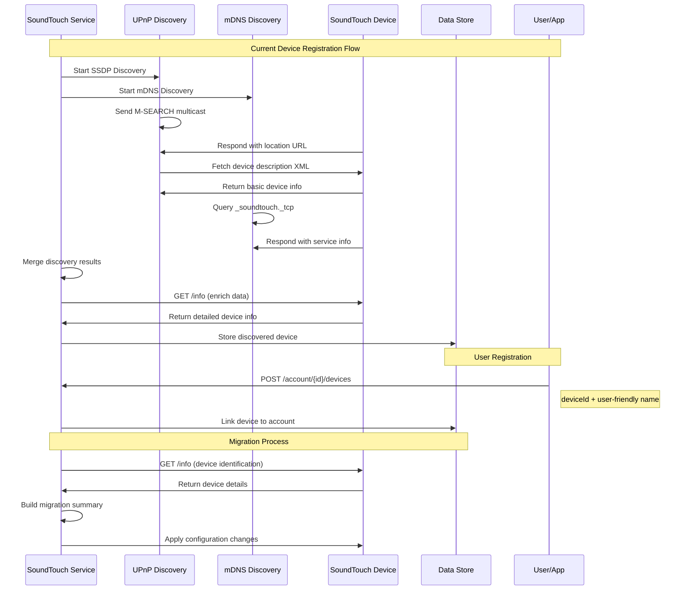
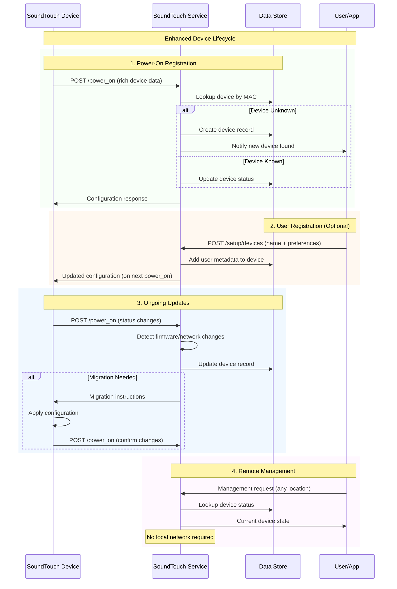

# Device Lifecycle and /power_on Enhancement

## Overview

This document provides a comprehensive analysis of the current SoundTouch device registration and lifecycle management implementation, and proposes enhancements using the `/power_on` endpoint to reduce dependency on local network connectivity.

## Current Implementation Assessment

### Device Information Sources

The current system uses multiple data collection methods to build a complete device profile:

#### 1. UPnP/SSDP Discovery
- **Protocol**: Multicast UDP discovery for `urn:schemas-upnp-org:service:SoundTouch:1`
- **Network Scope**: Limited to same network segment
- **Data Collected**:
  ```go
  type DiscoveredDevice struct {
      Name            string    // From UPnP friendlyName
      Host            string    // IP address
      Port            int       // Usually 8090
      ModelID         string    // From UPnP modelName  
      SerialNo        string    // MAC address from UPnP
      UPnPLocation    string    // Device description URL
      UPnPUSN         string    // Unique service name
  }
  ```

#### 2. mDNS/Bonjour Discovery
- **Protocol**: Multicast DNS for `_soundtouch._tcp` services
- **Network Scope**: Limited to same network segment
- **Purpose**: Complements UPnP discovery with hostname resolution

#### 3. `/info` Endpoint Enrichment
- **Protocol**: HTTP GET to `http://device:8090/info`
- **Network Scope**: Requires direct connectivity to device
- **Data Collected**:
  ```xml
  <info deviceID="ABCD1234EFGH">
      <name>My SoundTouch Device</name>
      <type>SoundTouch 10</type>
      <margeAccountUUID>1000001</margeAccountUUID>
      <components>
          <component>
              <componentCategory>SCM</componentCategory>
              <softwareVersion>27.0.6.46330.5043500...</softwareVersion>
              <serialNumber>I6332527703739342000020</serialNumber>
          </component>
      </components>
      <margeURL>https://streaming.bose.com</margeURL>
      <networkInfo type="SCM">
          <macAddress>AA:BB:CC:DD:EE:FF</macAddress>
          <ipAddress>192.0.2.10</ipAddress>
      </networkInfo>
      <moduleType>sm2</moduleType>
      <variant>rhino</variant>
      <countryCode>GB</countryCode>
  </info>
  ```

### Current Data Flow



### Device Registration Points

The system has distinct phases where device information is collected and enhanced:

#### Phase 1: Discovery (Network-Dependent)
**Trigger**: Automatic network scanning
**Data Sources**: UPnP + mDNS + `/info` endpoint
**Limitations**: ❌ Requires same network segment

#### Phase 2: User Registration (User-Controlled)
**Trigger**: User adds device to account
**Endpoint**: `POST /streaming/account/{accountId}/devices`
**Request Format**:
```xml
<device deviceid="08DF1F0BA325">
    <name>Living Room Speaker</name>
</device>
```
**Data Added**: ✅ User-friendly name, Account association

#### Phase 3: Ongoing Updates (Mixed)
**Triggers**: Device state changes, firmware updates, network changes
**Methods**: Periodic `/info` polling, Discovery refresh, User configuration

### Current Data Model

The system maintains comprehensive device information:

```go
type ServiceDeviceInfo struct {
    DeviceID            string `json:"device_id"`           // MAC or UUID
    Name                string `json:"name"`                // User-friendly name
    ProductCode         string `json:"product_code"`        // Device model
    DeviceSerialNumber  string `json:"device_serial_number"` // Hardware serial
    ProductSerialNumber string `json:"product_serial_number"` // Product serial
    FirmwareVersion     string `json:"firmware_version"`     // Software version
    IPAddress           string `json:"ip_address"`           // Current IP
    MacAddress          string `json:"mac_address"`          // MAC address
    AccountID           string `json:"account_id"`           // Account association
    DiscoveryMethod     string `json:"discovery_method"`     // How discovered
}
```

## Limitations of Current Approach

### Network Dependency Issues

| Issue | Impact | Affected Operations |
|-------|--------|-------------------|
| **Same Network Requirement** | High | Device discovery, Initial setup |
| **Direct Connectivity Need** | High | Device enrichment, Migration |
| **Firewall/NAT Restrictions** | Medium | Corporate networks, Complex setups |
| **Multi-VLAN Environments** | High | Enterprise deployments |
| **Remote Management** | Critical | Off-site device support |

### Service Architecture Limitations

1. **Geographic Constraints**: Service must be deployed on same network as speakers
2. **Scalability Issues**: Cannot centralize device management across multiple locations
3. **Discovery Reliability**: Multicast protocols can be unreliable in complex networks
4. **Real-time Updates**: No device-initiated communication for state changes

## /power_on Enhancement Proposal

### Current /power_on Request Analysis

The `/power_on` endpoint receives comprehensive device data that could replace many network-dependent operations:

```xml
<device-data>
    <device id="AABBCCDDEEFF">
        <serialnumber>I6332527703739342000020</serialnumber>
        <firmware-version>27.0.6.46330.5043500 epdbuild.trunk.hepdswbld04.2022-08-04T11:20:29</firmware-version>
        <product product_code="SoundTouch 10 sm2" type="5">
            <serialnumber>069231P63364828AE</serialnumber>
        </product>
    </device>
    <diagnostic-data>
        <device-landscape>
            <rssi>Excellent</rssi>
            <gateway-ip-address>192.0.2.1</gateway-ip-address>
            <macaddresses>
                <macaddress>AABBCCDDEEFF</macaddress>
                <macaddress>AABBCCDDEE01</macaddress>
            </macaddresses>
            <ip-address>192.0.2.10</ip-address>
            <network-connection-type>Wireless</network-connection-type>
        </device-landscape>
        <network-landscape>
            <network-data xmlns="http://www.Bose.com/Schemas/2012-12/NetworkMonitor/"/>
        </network-landscape>
    </diagnostic-data>
</device-data>
```

### Data Completeness Comparison

| Data Field | Current `/info` | `/power_on` | Gap Assessment |
|------------|----------------|-------------|----------------|
| **Device ID** | ✅ UUID format | ✅ MAC format | Different format |
| **Device Name** | ✅ Internal name | ❌ Missing | **Critical Gap** |
| **Device Type** | ✅ Model string | ✅ Product code | ✅ Available |
| **Account ID** | ✅ marge UUID | ❌ Missing | **Critical Gap** |
| **Service URL** | ✅ marge URL | ❌ Missing | **Important Gap** |
| **Firmware Version** | ✅ Full version | ✅ Full version | ✅ Available |
| **Serial Numbers** | ✅ Component serials | ✅ Device + Product | ✅ Available |
| **MAC Addresses** | ✅ Interface-specific | ✅ Multiple MACs | ✅ Enhanced |
| **IP Address** | ✅ Interface IPs | ✅ Current IP | ✅ Available |
| **Network Status** | ❌ Basic | ✅ Rich diagnostics | ✅ **Enhanced** |
| **Regional Settings** | ✅ Country/Region | ❌ Missing | **Important Gap** |

### Enhancement Benefits

#### 1. Network Independence
- ✅ Works across internet/WAN connections
- ✅ No multicast/broadcast requirements  
- ✅ Firewall/NAT friendly
- ✅ Supports remote device management

#### 2. Real-time Device State
- ✅ Device-initiated communication
- ✅ Power-on event notifications
- ✅ Network status updates
- ✅ Firmware change detection

#### 3. Enhanced Diagnostics
- ✅ Signal strength (RSSI)
- ✅ Gateway information
- ✅ Connection type details
- ✅ Real-time network status

### Implementation Strategy

#### Phase 1: Hybrid Approach
Implement `/power_on` processing while maintaining existing discovery methods:

```go
func (s *Server) HandleMargePowerOn(w http.ResponseWriter, r *http.Request) {
    // Parse power_on request
    var powerOnData models.CustomerSupportRequest
    if err := xml.Unmarshal(body, &powerOnData); err != nil {
        // Fallback to existing discovery
        return s.fallbackToDiscovery(r.RemoteAddr)
    }
    
    // Extract device information
    deviceMAC := powerOnData.Device.ID
    deviceIP := powerOnData.DiagnosticData.DeviceLandscape.IPAddress
    
    // Lookup existing device data
    deviceInfo := s.lookupDeviceByMAC(deviceMAC)
    if deviceInfo == nil {
        // New device - trigger registration flow
        deviceInfo = s.createDeviceFromPowerOn(powerOnData)
    }
    
    // Update with power_on data
    s.updateDeviceFromPowerOn(deviceInfo, powerOnData)
    
    // Determine response actions
    response := s.buildPowerOnResponse(deviceInfo)
    s.sendResponse(w, response)
}
```

#### Phase 2: Gap Resolution
Address missing data through complementary mechanisms:

1. **User-Friendly Names**: Maintain registration process for name assignment
2. **Account Association**: Enhance registration to link MAC addresses to accounts
3. **Service URLs**: Implement account-based service URL resolution
4. **Regional Settings**: Use IP geolocation or account preferences

#### Phase 3: Enhanced Device Lifecycle



### Migration Strategy

#### Current Migration Flow Issues
- Requires `/info` endpoint access for device identification
- Must be on same network for configuration changes
- Limited to devices discoverable via UPnP/mDNS

#### Enhanced Migration with /power_on

1. **Device Identification**: Use MAC address from `/power_on` instead of IP-based `/info`
2. **Configuration Delivery**: Send migration instructions in `/power_on` response
3. **Status Confirmation**: Device confirms changes via subsequent `/power_on` requests
4. **Remote Capability**: Manage devices from any network location

```go
type PowerOnResponse struct {
    ConfigurationUpdates []ConfigUpdate `json:"configuration_updates,omitempty"`
    MigrationInstructions *Migration    `json:"migration,omitempty"`
    RegistrationRequired  bool          `json:"registration_required,omitempty"`
}

type Migration struct {
    Method      string            `json:"method"`       // xml, hosts, resolv_conf
    TargetURL   string           `json:"target_url"`
    ProxyURL    string           `json:"proxy_url,omitempty"`
    Options     map[string]string `json:"options"`
}
```

## Recommendations

### Immediate Actions (Phase 1)
1. **Enhance `/power_on` handler** to extract and store comprehensive device data
2. **Implement device lookup by MAC address** as primary identification method  
3. **Create hybrid discovery system** using both `/power_on` and existing methods
4. **Add network-independent device management** capabilities

### Medium-term Improvements (Phase 2)  
1. **Implement account-device MAC mapping** for automatic association
2. **Add IP geolocation** for regional settings inference
3. **Create device registration UI** optimized for `/power_on` discovered devices
4. **Enhance migration system** to use `/power_on` response mechanism

### Long-term Enhancements (Phase 3)
1. **Request firmware enhancement** to include missing data in `/power_on`
2. **Implement real-time device monitoring** via `/power_on` events  
3. **Create centralized device management** independent of network topology
4. **Add predictive migration** based on device status patterns

### Risk Mitigation
- **Maintain backward compatibility** with existing discovery methods
- **Implement graceful fallbacks** when `/power_on` data is incomplete
- **Preserve existing user workflows** while adding enhanced capabilities
- **Add comprehensive logging** for troubleshooting hybrid approach

## Conclusion

The `/power_on` endpoint provides a significant opportunity to reduce network dependencies while enhancing device management capabilities. By implementing a hybrid approach that leverages `/power_on` data for primary device identification and status updates while maintaining existing registration workflows for user-controlled metadata, the system can achieve:

- **Network independence** for core device management
- **Enhanced real-time capabilities** through device-initiated communication  
- **Improved scalability** across diverse network topologies
- **Better user experience** with automatic device discovery and status updates

The proposed implementation strategy provides a clear path to achieve these benefits while maintaining system reliability and user workflow compatibility.