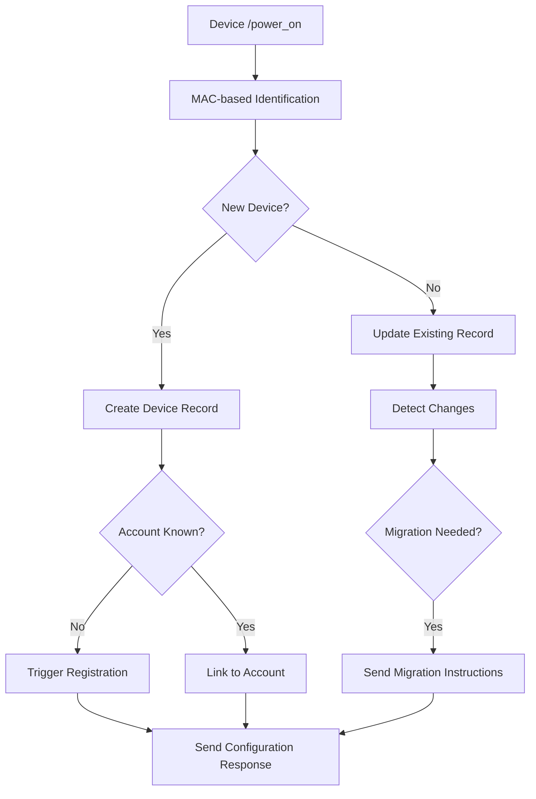

# Device Lifecycle Analysis - Executive Summary

## Current State Assessment

The SoundTouch service currently relies heavily on local network connectivity for device discovery and management:

### ✅ Strengths
- **Comprehensive device data** through `/info` endpoint
- **Robust discovery** via UPnP/SSDP + mDNS
- **User-controlled registration** with friendly names
- **Complete device lifecycle management**

### ❌ Limitations
- **Network dependency**: Requires same network segment for discovery
- **Geographic constraints**: Service must be co-located with devices
- **Firewall/NAT issues**: Multicast protocols unreliable in complex networks
- **No remote management**: Cannot manage devices from external networks

## /power_on Enhancement Opportunity

The `/power_on` endpoint provides rich device data that could eliminate network dependencies:

### Current /power_on Data
```xml
<device-data>
    <device id="AABBCCDDEEFF">                          <!-- ✅ Device MAC -->
        <serialnumber>I6332527703739342000020</serialnumber>   <!-- ✅ Serial -->
        <firmware-version>27.0.6.46330.5043500...</firmware-version> <!-- ✅ FW -->
        <product product_code="SoundTouch 10 sm2" type="5">    <!-- ✅ Model -->
            <serialnumber>069231P63364828AE</serialnumber>     <!-- ✅ Product Serial -->
        </product>
    </device>
    <diagnostic-data>
        <device-landscape>
            <rssi>Excellent</rssi>                              <!-- ✅ Signal -->
            <gateway-ip-address>192.0.2.1</gateway-ip-address> <!-- ✅ Network -->
            <macaddresses>                                       <!-- ✅ All MACs -->
                <macaddress>AABBCCDDEEFF</macaddress>
                <macaddress>AABBCCDDEE01</macaddress>
            </macaddresses>
            <ip-address>192.0.2.10</ip-address>            <!-- ✅ Current IP -->
            <network-connection-type>Wireless</network-connection-type> <!-- ✅ Connection -->
        </device-landscape>
    </diagnostic-data>
</device-data>
```

### Missing Data Gaps
| Data | Current Source | Available in /power_on | Impact |
|------|----------------|----------------------|---------|
| **User-friendly name** | Registration | ❌ Missing | **High** - UI/UX |
| **Account association** | Registration | ❌ Missing | **Critical** - Authorization |
| **Service URLs** | `/info` | ❌ Missing | **High** - Migration |
| **Regional settings** | `/info` | ❌ Missing | **Medium** - Localization |

## Recommended Implementation Strategy

### Phase 1: Hybrid Enhancement (Immediate)
- **Enhance `/power_on` handler** to process full device data
- **Implement MAC-based device lookup** for identification
- **Maintain existing registration flow** for user metadata
- **Add network-independent capabilities** as primary features

```go
// Enhanced flow
Device -> POST /power_on -> Service identifies by MAC -> Update/Create device record
```

### Phase 2: Gap Resolution (Short-term)
- **Account-device MAC mapping** for automatic association
- **IP geolocation** for regional settings inference  
- **Registration UI optimization** for /power_on discovered devices
- **Migration via response payload** instead of direct device access

### Phase 3: Full Network Independence (Medium-term)
- **Centralized device management** across multiple networks
- **Real-time device monitoring** via /power_on events
- **Predictive migration** based on device status patterns
- **Enhanced firmware integration** with additional /power_on data

## Key Benefits

### ✅ Immediate Gains
- **Network independence**: Manage devices from any location
- **Real-time updates**: Device-initiated status reporting
- **Enhanced diagnostics**: Signal strength, connection type, network status
- **Simplified deployment**: No multicast/broadcast requirements

### ✅ Long-term Advantages  
- **Scalable architecture**: Centralized management across sites
- **Improved reliability**: Eliminates discovery protocol dependencies
- **Better user experience**: Automatic device detection and status
- **Future-proof design**: Device-driven communication model

## Implementation Approach

### Hybrid Strategy


### Risk Mitigation
- **Maintain backward compatibility** with existing discovery
- **Graceful fallbacks** when /power_on data incomplete
- **Preserve user workflows** while adding enhanced capabilities
- **Comprehensive logging** for troubleshooting

## Success Metrics

### Technical Metrics
- **Network independence**: % of operations not requiring local network
- **Real-time capability**: Power-on event processing latency < 2s
- **Data completeness**: % of devices with full metadata via /power_on
- **Migration success**: % of successful remote migrations

### User Experience Metrics
- **Discovery reliability**: % of devices automatically detected
- **Setup time**: Time from device power-on to full management
- **Management accessibility**: % of operations available remotely
- **Error reduction**: Decrease in network-related issues

## Conclusion

The `/power_on` enhancement represents a strategic opportunity to:

1. **Eliminate network dependencies** while maintaining full functionality
2. **Enable remote device management** across diverse network topologies  
3. **Improve user experience** through automatic device detection
4. **Future-proof the architecture** for scalable device management

**Recommendation**: Proceed with hybrid implementation approach, prioritizing network independence while preserving existing user workflows and system reliability.

**Timeline**: Phase 1 implementation feasible within 2-3 sprints, with Phases 2-3 extending capabilities based on user feedback and firmware enhancement opportunities.