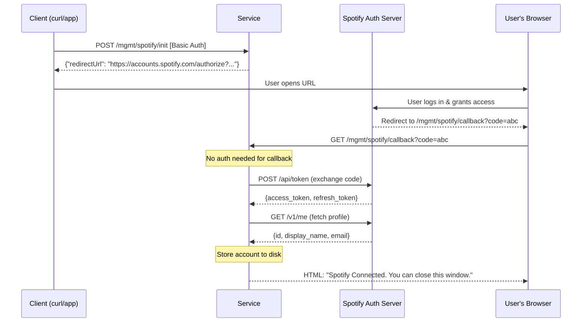
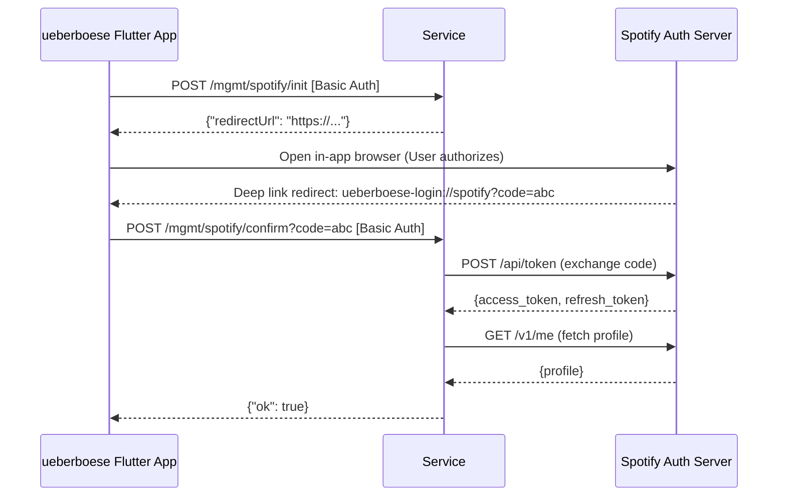
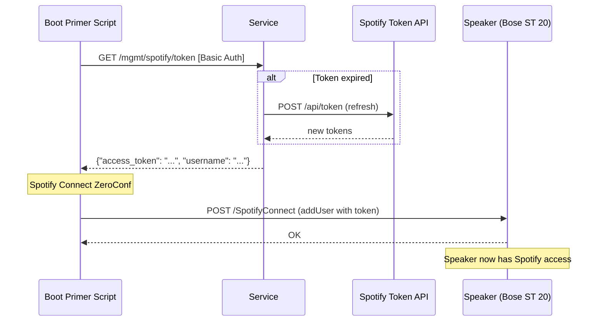

# Spotify OAuth Integration

> **New here?** Start with [spotify-overview.md](spotify-overview.md) for the
> mental model (Spotify Connect vs OAuth-intercept, DNS rewrite gotcha,
> end-to-end token lifecycle). This document zooms in on the OAuth flows and
> management endpoints.

The SoundTouch service supports Spotify OAuth integration to broker access tokens for SoundTouch speakers. This is particularly useful for maintaining Spotify Connect functionality after the Bose cloud shutdown (scheduled for May 2026).

## OAuth Flows

The service supports two primary OAuth flows: a browser-based flow and a mobile app-based flow (specifically for the [ueberboese](https://github.com/julius-d/ueberboese-app) app).

### 1. Browser-based Flow

The user initiates the flow, completes authorization in their browser, and is redirected back to the service.

### 2. Mobile App Flow (ueberboese)

The mobile app handles the redirect via a deep link and then confirms the authorization with the service.

### 3. Token Retrieval (Boot Primer / Speaker Setup)

Once an account is linked, access tokens can be retrieved for use with speakers (e.g., via the `addUser` ZeroConf command).

## Priming Speakers

> **Note:** The on-device boot-primer flow (installing `spotify-boot-primer.sh` onto the speaker's `/mnt/nv` and hooking it from `rc.local`) is **deprecated**. AfterTouch now uses a server-centric model: the service registers a `SPOTIFY` source in marge for the device's paired account and pushes credentials via ZeroConf from the server side, triggered on `power_on` and a manual "Prime" action. See [spotify-priming-strategy.md](spotify-priming-strategy.md) for the current model and rationale.
>
> The artifacts under `scripts/spotify/` are kept as historical reference for users who still rely on the on-device approach. There is no longer a `/mgmt/devices/{deviceId}/spotify/install-primer` endpoint.

## Endpoints

| Method | Path                                              | Auth  | Purpose                                                               |
|--------|---------------------------------------------------|-------|-----------------------------------------------------------------------|
| POST   | `/mgmt/spotify/init`                              | Basic | Start OAuth flow, returns authorization URL                           |
| GET    | `/mgmt/spotify/callback`                          | None  | Browser OAuth callback (redirect from Spotify, returns HTML)          |
| POST   | `/mgmt/spotify/confirm`                           | Basic | Mobile app confirm (ueberboese deep link delivers code, returns JSON) |
| GET    | `/mgmt/spotify/accounts`                          | Basic | List linked Spotify accounts (tokens stripped)                        |
| GET    | `/mgmt/spotify/token`                             | Basic | Get fresh access token (auto-refreshes if expired)                    |
| POST   | `/mgmt/spotify/entity`                            | Basic | Resolve Spotify URI to name + image URL                               |
| POST   | `/mgmt/spotify/prime`                             | Basic | Manually trigger server-side priming of a discovered speaker          |

## Security

- `/mgmt/spotify/callback` is intentionally outside Basic Auth to allow direct redirects from Spotify's authorization server.
- All other `/mgmt/*` endpoints require Basic Auth as configured by `--mgmt-username` and `--mgmt-password`.
- Tokens are persisted to disk as JSON with restricted file permissions (`0600`).
- The `GetAccounts` endpoint strips sensitive tokens from the response.
