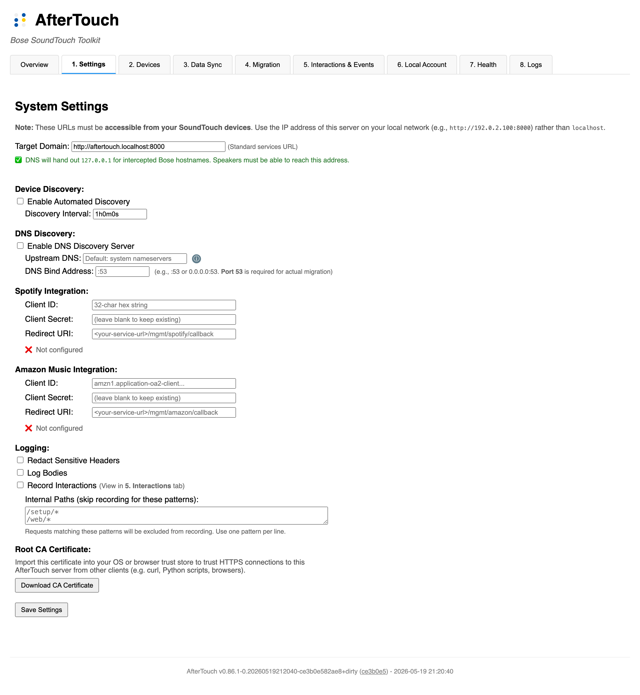
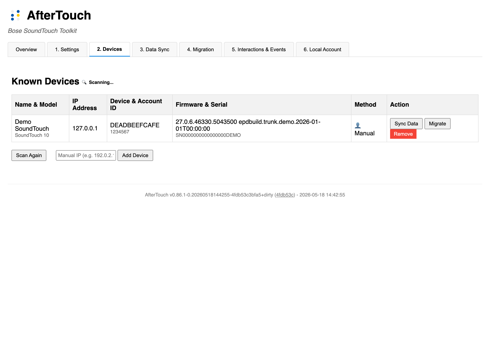
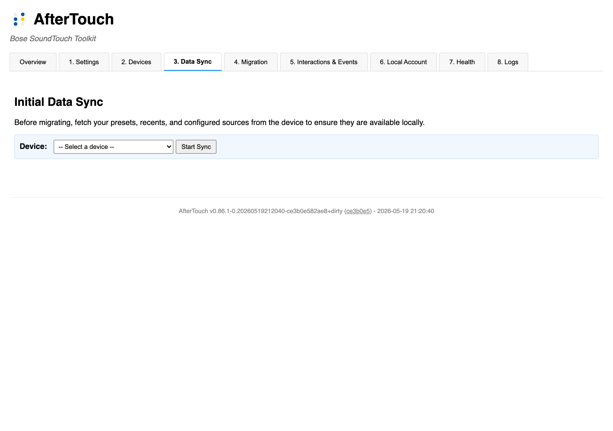
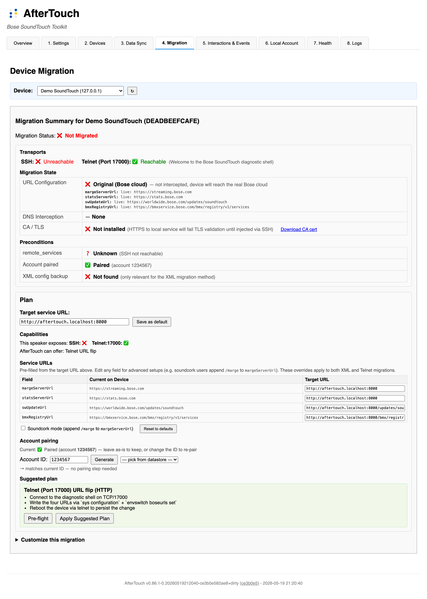

# Migration Guide: From Bose Cloud to AfterTouch

This guide walks through the complete process of migrating your SoundTouch speakers from Bose's cloud services to **AfterTouch**, the local replacement provided by `soundtouch-service`. By the end, your speakers will work fully independently of Bose's servers.

For a shorter overview, see the [Survival Guide](SURVIVAL-GUIDE.md). For safety considerations and rollback options, see the [Migration & Safety Guide](MIGRATION-SAFETY.md).

---

## What you need

- A machine that is **always on** (Raspberry Pi, NAS, home server, or similar) to run the service
- A **USB drive** (FAT-formatted) to enable SSH on each speaker
- Your speakers must be on the **same network** as the service host
- About **15–30 minutes per speaker**

---

## Step 1: Install and start the service

Choose the option that fits your setup.

### Binary (go install)

```bash
go install github.com/gesellix/bose-soundtouch/cmd/soundtouch-service@latest
soundtouch-service
```

The service starts on port 8000. Open `http://localhost:8000` in your browser.

### Docker Compose (recommended for home servers and VMs)

The repository ships a `docker-compose.yml` ready for this use case. Clone or download it, copy the example config, then edit `.env` before starting:

```bash
cp .env.example .env
# Edit .env:
#   SOUNDTOUCH_HOSTNAME=192.168.1.100   ← your server's address
#   SOUNDTOUCH_VERSION=v0.70.0          ← pin to a release tag instead of 'latest'
docker compose up -d
```

`SOUNDTOUCH_HOSTNAME` is the address your speakers will use to reach the service — use a hostname or IP reachable from the speaker, not `localhost`.

On **Linux** (Debian, Proxmox VE, Raspberry Pi OS, etc.) you can enable host networking for automatic speaker discovery. Uncomment the `network_mode: host` line in `docker-compose.yml` and remove the `ports:` section (they conflict with host networking). Without host networking, add your speakers by IP address in Step 4 instead.

For local overrides (e.g. switching to `build: .` during development), create a `docker-compose.override.yml` — Docker Compose picks it up automatically and it is not tracked in version control.

> **Note on `docker-compose.ci.yml`**: this file contains mock services used only for automated integration tests. It is not needed for your own deployment.

### Docker run (Linux — with host networking for device discovery)

```bash
docker run -d \
  --name soundtouch-service \
  --network host \
  -v $(pwd)/data:/app/data \
  ghcr.io/gesellix/bose-soundtouch:latest
```

### Docker run (macOS / Windows — manual device IP required)

```bash
docker run -d \
  --name soundtouch-service \
  -p 8000:8000 -p 8443:8443 \
  -v $(pwd)/data:/app/data \
  --env SERVER_URL=http://soundtouch.local:8000 \
  --env HTTPS_SERVER_URL=https://soundtouch.local:8443 \
  ghcr.io/gesellix/bose-soundtouch:latest
```

On macOS/Windows, device discovery via mDNS won't work inside the container — you'll add devices by IP address in Step 4.

See [Raspberry Pi Setup](RASPBERRY-PI.md) and the [SoundTouch Service Guide](SOUNDTOUCH-SERVICE.md) for more deployment options.

---

## Step 2: Configure the service URL

Open `http://<server>:8000` and go to the **Settings** tab.



Set the **Target Domain** to the address your speakers can reach — for example `https://soundtouch.fritz.box` or `http://192.168.1.100:8000`. This must be the host's address on your local network, not `localhost`.

If you plan to use DNS/DHCP redirect, enable the **DNS Discovery Server** and set the **DNS Bind Address** to `:53`. The upstream DNS should be your router's IP, not the service's own address.

> **Tip**: If you change settings and they don't seem to take effect, check `data/settings.json` — settings saved in the UI take precedence over environment variables.

---

## Step 3: Enable shell access on each speaker

The wizard supports **two transports** for talking to the speaker. Pick whichever your device exposes:

### SSH (recommended — required for XML migration, DNS interception, and CA install)

The XML migration writes updated configuration to the speaker's filesystem, which requires SSH access. Enable it once per device:

1. Format a USB drive as FAT (FAT32). Some speakers require the **bootable flag** to be set on the partition — see [SoundCork issue #172](https://github.com/deborahgu/soundcork/issues/172) for details.
2. Create an empty file named **`remote_services`** (no extension) in the root of the drive.
3. Insert the drive into the speaker's USB port while it is powered on.
4. Power-cycle the speaker (unplug the power cable, wait 10 seconds, reconnect).
5. After boot, root SSH is available with no password: `ssh -oHostKeyAlgorithms=+ssh-rsa root@<SPEAKER-IP>`

You only need to do this once per speaker. SSH can remain enabled for future maintenance or be disabled after migration — your choice.

### Telnet:17000 (fallback when SSH isn't possible)

If the USB-stick unlock doesn't work on your speaker (some firmware revisions refuse it — notably SA-5, ST520, and recent ST Portables), the wizard falls back to the speaker's **built-in diagnostic shell on TCP port 17000**. No setup required — most SoundTouch firmware exposes it automatically. The wizard detects which transports are available and picks the right one; you don't have to choose manually.

Telnet-only migrations are limited to HTTP (no CA install possible without SSH). The wizard surfaces this clearly when it applies.

---

## Step 4: Add and sync your speaker

### Discover

The service scans for SoundTouch devices automatically every few minutes. Check the **Devices** tab in the web UI. If your speaker doesn't appear, click **Scan Again** to trigger an immediate scan, or enter the IP address manually and click **Add Device**.



### Sync

Once the speaker appears, click **Sync Data**. This connects to the speaker and pulls its current presets, recently played items, and configured sources into the local service's datastore. It also creates an off-device backup of the speaker's configuration.



If the Bose cloud is still running, Sync also fetches your account data from Bose's servers. This is your preservation step — do it before the cloud shuts down.

---

## Step 5: Migrate

Click **Migrate** next to a device on the Devices tab to open the Migration tab. The tab opens with a **Migration Summary** that shows where your speaker currently stands, then offers a one-click suggested plan and a fully customizable form underneath.



### What you see at the top — the state card

Three rows tell you the speaker's current state at a glance:

- **Transports** — whether SSH and Telnet:17000 are reachable. The wizard's choices are driven by these.
- **Migration State** — three orthogonal axes:
  - *URL Configuration* — original Bose URLs or AfterTouch URLs (with a special "intercepted via DNS" verdict when the resolv.conf hook is doing the redirect).
  - *DNS Interception* — none, or `/etc/resolv.conf` hook active.
  - *CA / TLS* — local root CA installed on the device, with `Trust CA Now` and `Download CA cert` actions inline.
- **Preconditions** — `remote_services` persistence, account pairing state, and XML config backup presence.

### The Plan card — the happy path

Below the state card is the **Plan** card. For most users this is the only thing you'll touch:

1. **Target service URL** — pre-filled from your Settings. Edit inline and click *Save as default* to update Settings without bouncing tabs.
2. **Capabilities** — what transports the speaker exposes and what AfterTouch can offer given those.
3. **Service URLs** — four URL inputs (margeServerUrl, statsServerUrl, swUpdateUrl, bmxRegistryUrl) pre-filled with canonical defaults. Most users leave them as-is; soundcork users tick the *Soundcork mode* checkbox to append `/marge` to `margeServerUrl`. URL validation runs on every keystroke.
4. **Account pairing** — pre-filled with the speaker's current account ID. Leave it to keep the existing pairing, change it to re-pair, or click *Generate* to assign a new 7-digit ID on a factory-reset device.
5. **Suggested plan** — one big green button: *Apply Suggested Plan*. The wizard picks the most conservative recipe for your speaker (XML over SSH with HTTP when SSH works; telnet URL flip with HTTP when only telnet works) and runs it.

### What happens when you click Apply

The wizard switches to a visible **Pre-flight checks** panel and runs every applicable verification before touching the speaker:

- **Backend summary re-check** — confirms transports, hostname resolution, and that the URLs you plan to write match what the backend would produce.
- **HTTPS connection from device** (SSH-capable speakers) — uploads a temporary CA and runs `curl` from the speaker to your service.
- **Reachability check (passive observer)** (already-migrated speakers) — nudges `:8090/swUpdateCheck` on the device and watches for *any* request from the speaker to land on the service. Used when the speaker is already migrated and the service is the natural target of its outbounds.
- **"Round-trip validation runs after Apply + reboot"** (not-yet-migrated speakers) — surfaced as a skip row with a rationale. The speaker's swUpdate daemon caches its URL at boot, so there is no useful no-reboot round-trip check pre-migration; the canonical telnet flow is Apply → reboot → re-run pre-flight on the migrated speaker.
- **DNS redirection from device** — when DNS interception is part of the plan.

On all-green, the wizard auto-proceeds. On any failure, it pauses with *Proceed Anyway* / *Cancel* buttons so you can override on a known-false-positive (slow DNS, etc.) or fix the underlying issue and retry.

### Customize this migration — for mix-and-match

Expand the `▸ Customize this migration` section to pick any combination of three independent axes:

- **URL flip transport** — XML over SSH / Telnet (Port 17000) / Skip
- **DNS interception** — None / `/etc/resolv.conf` hook
- **Local CA install** — checkbox (SSH-only)

Each option carries a per-axis availability hint (e.g. *(SSH unreachable)*, *(already trusted)*) so you see why an option is disabled before you pick. *Apply Custom Plan* runs the chosen combination as a sequence; the same pre-flight panel gates the execution.

> **Note**: DNS interception bundles the CA install on the backend, so a standalone CA-install step is skipped automatically when DNS is part of the plan. The wizard handles this for you.

---

## Step 6: Reboot and verify

After a successful Apply the wizard auto-expands the Customize section and highlights the **Reboot Speaker** button. Click it (or power-cycle the speaker manually) to apply all configuration changes. The reboot transport is picked automatically from your URL flip choice — telnet reboot for SSH-less speakers, SSH reboot otherwise.

After reboot:
- The speaker should appear as **migrated** in the Devices tab
- The state card on the Migration tab should now show ✅ for URL Configuration (or "intercepted via DNS" if you used the resolv.conf hook)
- Presets should load and play (served from the local service)
- TuneIn browsing should work
- Recently played items should appear

If something doesn't work, check the **Interactions** tab in the web UI for failed requests, and the **Troubleshooting** section in the [SoundTouch Service Guide](SOUNDTOUCH-SERVICE.md).

---

## Repeat for each speaker

Each speaker is migrated independently. You can run multiple migrations in parallel, but migrating one at a time makes it easier to diagnose issues.

---

## Rollback

If you need to undo a migration:

- **From the web UI**: Use the **Revert to Defaults** action on the device — this restores the `.original` backup files created on the speaker during the XML migration.
- **Telnet-only migrations**: the wizard writes both the runtime configuration layer (`sys configuration …`) and the persistent layer (`envswitch boseurls set …`) so the migration survives reboot. If you want to revert quickly, the cleanest path is to re-run the wizard with the original Bose URLs in the URL editor.
- **Via SSH**: The original XML config is backed up on the speaker with a `.original` suffix. Restore it manually if the UI is unreachable.
- **Factory reset**: As a last resort, perform a factory reset (see [Device Initial Setup](DEVICE-INITIAL-SETUP.md) for button sequences). This wipes all configuration and returns the speaker to out-of-box state.

---

## Post-migration

Once all speakers are migrated, the `data/` directory is the source of truth for your presets, recents, and device state. Back it up periodically. The web UI at `http://<server>:8000` is your management interface from this point on.

For the Bose cloud backup you created in Step 4, keep the `.tar.gz` archive in case you need to restore credentials or presets later.
